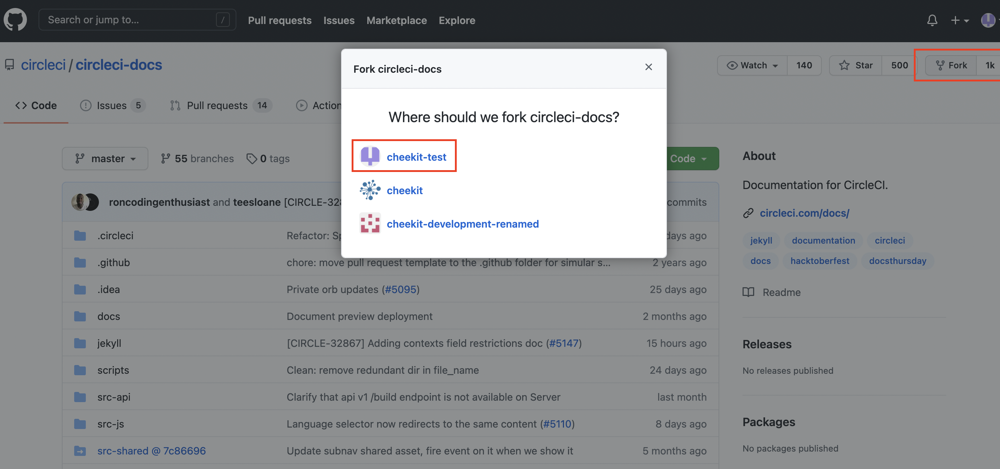
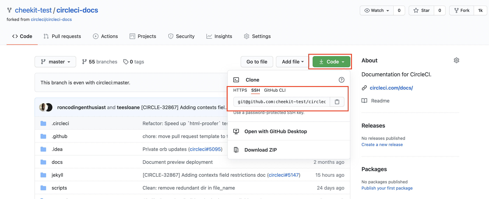
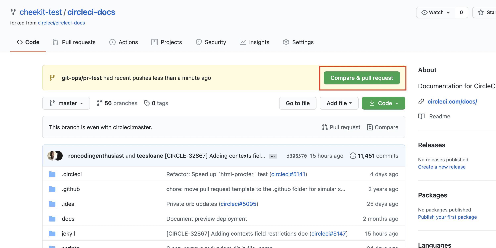

# Git Tips

## インストール

- git
- vscode(Visual Studio Code) : エディタ

### Git

Mac を利用している場合、標準でインストールされている`Terminal.app`を開き、以下のコマンドを入力し、エンターキーを押す

```
$ brew install git
```

### vscode (Visual Studio Code)

以下のページからDownloadでvscodeをインストールしてください
> https://code.visualstudio.com/

## Gitのセットアップ

Gitのセットアップでは秘密鍵・公開鍵を作成し、Githubとの接続で利用できる状態にします。
これにより毎回の接続でユーザー名・パスワードを求められることがなく、より安全にGithubを利用することができます。

※注意としてタイプミスがないよう、コマンドを実行する場合はすべて`Copy and Paste`してください。
`$ `はターミナルのカーソルを示しますので、`$ `以降を`Copy and Paste`してください。

1. [Githubのアカウントを作成](#create-github-account)
2. [sshkeyを作成](#create-sshkey)
3. [sshkeyをGithub上に登録しGithubへの接続確認](#save-ssh-key)
4. [ローカルのgitの設定](#configure-git)

### <a id="create-github-account" href="#create-github-account">1.Githubのアカウントを作成</a>

`Sign up` をクリックしアカウントを登録、アカウント確認用のメールをチェックする
> https://github.com/

### <a id='create-sshkey' href='#create-sshkey'>2. sshkeyを作成</a>

2-1. ターミナルにて以下のコマンドを実行する、今までに秘密鍵を作成したことがない場合は、すべてEnterをクリック

```
$ ssh-keygen -t ed25519 -C "your_email@example.com"
```

デフォルトでは以下の2つのファイルが作成されます。

```
$ ls ~/.ssh/id_ed25519 # 秘密鍵
$ ls ~/.ssh/id_ed25519.pub # 公開鍵
```

2-2. ターミナルにて以下のコマンドを実行し、ssh-agentを起動する
```
$ eval "$(ssh-agent -s)"
```

2-3. sshの設定を修正

`~/.ssh/config`が存在するか確認する。

```
$ ls ~/.ssh/config
```

以下のメッセージが表示される場合は、以下のコマンドを実行する
`ls: /Users/<your account name>/.ssh/config: No such file or directory`

```
$ touch ~/.ssh/config
```

VSCodeでファイルを編集

```
$ code ~/.ssh/config
```

以下を貼り付け、`command+s`で保存
```
Host *
  AddKeysToAgent yes
  UseKeychain yes
  IdentityFile ~/.ssh/id_ed25519
```

### <a id='save-ssh-key' href='#save-ssh-key'>3. sshkeyをGithub上に登録しGithubへの接続確認</a>

3-1. ターミナルで以下のコマンドを利用し、前のステップで作成した公開鍵をクリップボードにコピーする

```
$ pbcopy < ~/.ssh/id_ed25519.pub
```

3-2. 以下のページにアクセスし、`New SSH key`ボタンを押し、前のステップで公開鍵を`Key`にペーストし、Titleに適当な名前（例: PC名）を入力し、`Add SSH key`ボタンで、公開鍵を登録します。

> https://github.com/settings/keys

3-3. ターミナルで以下のコマンドを実行し、Githubと秘密鍵を利用し接続できるか確認します。同様のメッセージが表示されれば成功です。

```
$ ssh -T git@github.com
Hi <Your Github account name>! You've successfully authenticated, but GitHub does not provide shell access.
```

### <a id='configure-git' href='#configure-git'>4. ローカルのGitの設定</a>

4-1. ターミナルから以下のコマンドを入力し、gitに紐づくアカウント名、メールアドレスを設定します。
こちらの設定はGitでコミットを行う際に利用されます。

```
$ git config --global user.name "<GITHUB account name>"
$ git config --global user.email "<Your email address>"
```

## Gitの基本コマンド

0. Gitの初期化

Gitの基本コマンドをテストとして実行する場合は、以下のように別ディレクトリを作成し実行してください。

```
$ mkdir ~/repos
$ cd ~/repos
$ mkdir git-ops && cd git-ops
$ git init
Initialized empty Git repository in /Users/<username>/repos/git-ops/.git/
```

1. 変更を確認

現在のブランチ名や変更されたファイルの情報を確認できます。

```
$ git status
On branch master

No commits yet

nothing to commit (create/copy files and use "git add" to track)
```

2. ファイルをコミット

GitのコミットとはGit上でファイルの変更を記録する1つの単位です。
1つのコミットには複数のファイルの変更が含めることができます。

どのファイルをコミットに含めるか決めるために、`git add`を利用します。

```
$ echo 'hello' > README.md
$ git add README.md
```

変更を確認。現在`README.md`ファイルがコミット可能となっています。

```
$ git status
On branch master

No commits yet

Changes to be committed:
  (use "git rm --cached <file>..." to unstage)
        new file:   README.md
```

コミットを追加。コミットには必ずメッセージをつける必要があります。そのため`-m`オプション設定し、その後にコミットメッセージを指定しています。

```
$ git commit -m 'add README.md'
[master 2e98bd2] add README.md
 1 file changed, 1 insertion(+)
 create mode 100644 README.md
```

コミットのログを確認。ターミナル上で`:q`を順番に入力し、エディタを終了できます。

```
$ git log
commit 2e98bd24c18fee814b35bf0e22799ef113ac2899 (HEAD -> master)
Author: ganezasan <istaka12@gmail.com>
Date:   Tue Mar 16 11:15:35 2021 +0900

    add README.md
```

3. git addの取り消し

ファイルを修正し、`git add`を実行します。

```
$ echo 'world' >> README.md
$ git add README.md
```

`git status`で`README.md`が`add`されていることを確認します。

```
$ git status
On branch master
Changes to be committed:
  (use "git restore --staged <file>..." to unstage)
        modified:   README.md
```

`git reset`を利用することで、`git add`を取り消すことができます。

```
$ git reset README.md
Unstaged changes after reset:
M       README.md
```

`git status`を利用し`README.md`が`git add`されていないことを確認できます。

```
$ git status
On branch master
Changes not staged for commit:
  (use "git add <file>..." to update what will be committed)
  (use "git restore <file>..." to discard changes in working directory)
        modified:   README.md
```

4. 前回のコミットをコミット前の状態に戻す

※ コミットが1つしか無い状態では利用できません。変更は残ったままになります。

```
$ git reset --soft HEAD^
```

5. 新しいブランチを作成し、そのブランチへ移動

```
$ git checkout -b <new branch name>
$ git checkout -b test/checkout
Switched to a new branch 'test/checkout'
```

6. ブランチを移動

```
$ git checkout master
```

7. ブランチを削除

```
$ git branch -d test/checkout
```

8. Githubのリポジトリへ変更(commit)をpush

```
$ git push origin <local branch name>:<github branch name>
$ git push origin test # localのtestブランチをgithub上のtestブランチにpushする
$ git push origin test:test/git-ops # localのtestブランチをgithub上のtest/git-opsブランチにpushする
$ git push origin head # `head`は現在作業中のブランチ名のエイリアスです。現在作業中のブランチ(例えば`test`)をgithub上の現在作業中のブランチ名(`test`)にpushする
```

9. 変更の差分を確認

```
$ git diff
$ git diff --cached #すでにaddしたファイルの差分を確認する
```

## Gitを利用した実際のユースケース

- [プロジェクトのForkしPRを作成](#fork)
- [Upstreamから最新の変更をForkリポジトリに反映させる](#fetch-upstream)
- [対象のPullRequestを取得](#fetch-pr)

### <a id='#fork' href="#fork">プロジェクトのForkする</a>

1. circleci-docsをフォーク（自分のアカウント配下にコピーを作成）する

[circleci-docs](https://github.com/circleci/circleci-docs)リポジトリのページへアクセスし、右上の`Fork`ボタンをクリックし、その後、自分のアカウントを選択しフォークプロジェクトを作成する



2. `Code`ボタンをクリック、`SSH`を選択し、clone用のURLをコピーする




3. 作業用のディレクトリを作成し移動

```
$ mkdir ~/repos
$ cd ~/repos
```

4. circleci-docsのレポジトリをチェックアウト

```
$ git clone git@github.com:cheekit-test/circleci-docs.git
Cloning into 'circleci-docs'...
remote: Enumerating objects: 147, done.
remote: Counting objects: 100% (147/147), done.
remote: Compressing objects: 100% (116/116), done.
remote: Total 61258 (delta 85), reused 56 (delta 31), pack-reused 61111
Receiving objects: 100% (61258/61258), 123.18 MiB | 2.56 MiB/s, done.
Resolving deltas: 100% (45876/45876), done.
```

5. 新しくブランチを作成し、コミットを追加し、Github上のForkしたプロジェクトへpushする

※ 基本的に新しくブランチを作成する場合は`master`ブランチから作成します。

```
$ cd circleci-docs
$ git checkout -b git-ops/pr-test
$ echo 'hello' >> README.md
$ git add .
$ git commit -m 'update README'
$ git push origin head
```

6. Github上でForkしたリポジトリからUpstream（circleci/circleci-docs）のリポジトリへPullRequestを送信する



PullRequestのTitleやDescriptionは過去のPRを参考になるべく詳細を追記する
JIRAチケットがある場合は、URLを追記する

### <a id='#fetch-upstream' href="#fetch-upstream">Upstreamから最新の変更をForkリポジトリに反映させる</a>

1. Upstream(circleci/circleci-docs)をgitのリモートリポジトリとして登録する

```
$ git remote add upstream git@github.com:circleci/circleci-docs.git
```

`origin`と`upstream`が存在することを確認する。

```
$ git remote -v
origin  git@github.com:cheekit-test/circleci-docs.git (fetch)
origin  git@github.com:cheekit-test/circleci-docs.git (push)
upstream        git@github.com:circleci/circleci-docs.git (fetch)
upstream        git@github.com:circleci/circleci-docs.git (push)
```

2. `master`にブランチを移動し、`git pull`コマンドでupstreamリポジトリの`master`ブランチに追加された変更をローカルの`master`ブランチに反映させます

```
$ git checkout master
$ git pull upstream --rebase master
```

### <a id='#fetch-pr' href="#fetch-pr">対象のPullRequestを取得</a>

PRを取得するためのコマンドは以下になります。

```
$ git fetch upstream pull/ID/head:BRANCH_NAME
```

実際に次のサンプルのPRをローカルに取得する場合は以下のコマンドを利用します。BRANCH_NAMEはGithub上の以下のPRのUI上で確認します。
> https://github.com/circleci/circleci-docs/pull/5150

```
$ git fetch upstream pull/5150/head:translation/git-test
From github.com.sub:circleci/circleci-docs
 * [new ref]           refs/pull/5150/head -> translation/git-test
```

checkout コマンドを利用してブランチを移動できます。
```
$ git checkout translation/git-test
```

## Gitに関する参考資料
- https://backlog.com/ja/git-tutorial/
- https://dotinstall.com/lessons/basic_git
